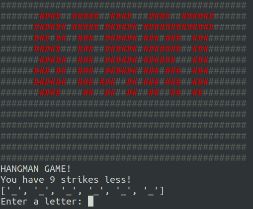
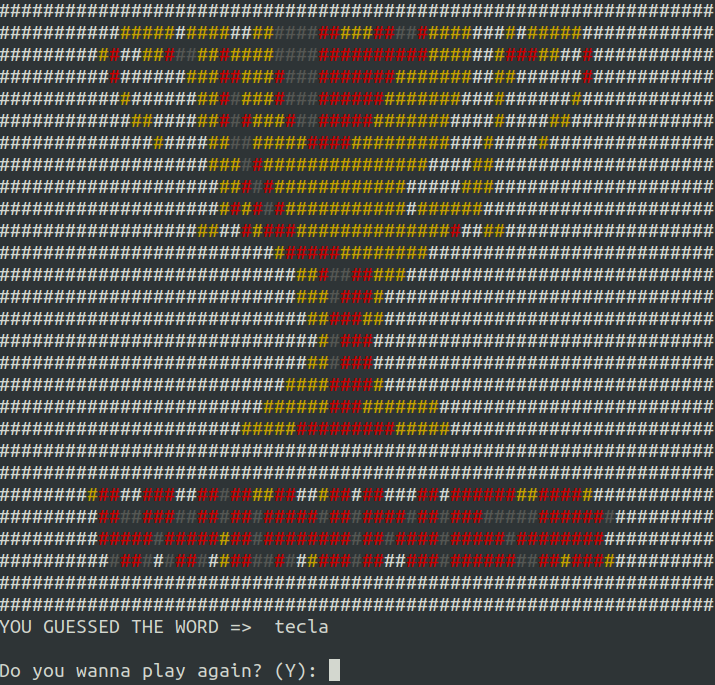
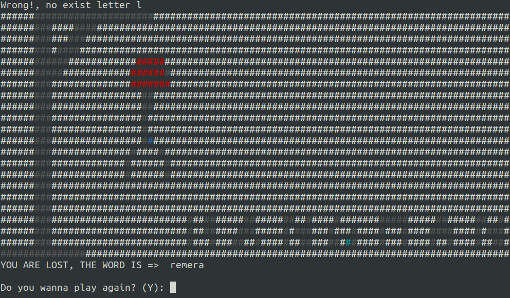

## Python HANGMAN Game

Python HANGMAN Game for Console is a game application replicating hangman game, consist in guessing letters to complete a word, if you waste chances, YOU'RE LOSS!.

Builted with Python 3 it contains:

-   class
-   list comprehensions
-   imports
-   handler try/except
-   reading file
-   ordered contect and converted
-   multi language
-   record for points

## Run the app

-   Execute `python -m pip install -r requirements.txt`
-   Execute `python hangman.py` and start guessing the words!

## Screenshot

Starting Game.

Keep Going.

Wrong.

Won.

Lost.

